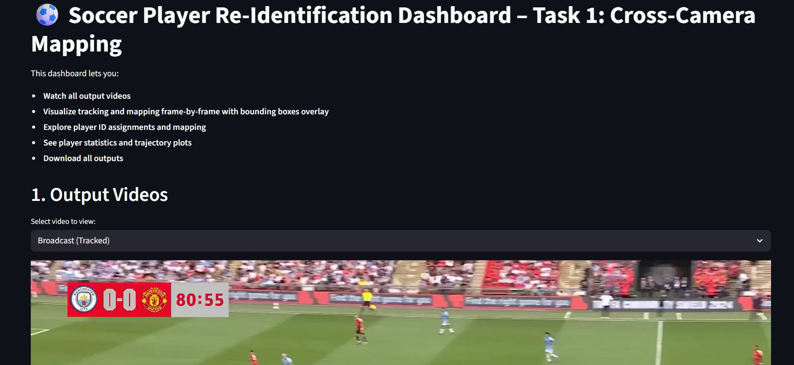

# Soccer Player Re-Identification – Task 1: Cross-Camera Mapping

[](https://soccer-8yec.onrender.com/)

**Live Demo:** [https://soccer-8yec.onrender.com/](https://soccer-8yec.onrender.com/)

**Developed by Vivek V Nair**

All instructions, evaluation criteria, and detailed documentation are provided in the main `README.md` and `report.md` at the project root.

This folder contains only the code, requirements, and dashboard for Task 1.

- To run the pipeline, see the root README for setup and usage.
- For methodology and results, see the root report.
- Simplicity, modularity, and clarity of code
- Documentation quality
- Runtime efficiency (bonus)
- Creativity and thoughtfulness
- **Reproducibility:** All outputs can be regenerated using scripts and instructions.
- **Documentation:** Clear README, report, and code comments.
- **Efficiency:** Reasonable runtime and modular design.
- **Modularity:** Logical code structure for each pipeline stage.

## Folder Structure
```
task1/
├── src/                # Source code for detection, tracking, mapping, etc.
├── data/               # Videos, outputs, and JSONs (symlink or copy from main data/)
├── models/             # Model weights (symlink or copy from main models/)
├── requirements.txt    # Dependencies (symlink or copy from main)
├── README.md           # This file
├── report.md           # Project report for Task 1
```

## How to Run
1. Place `broadcast.mp4` and `tacticam.mp4` in `task1/data/`, and model weights in `task1/models/`.
2. Install dependencies:
   ```bash
   pip install -r requirements.txt
   ```
3. Run the pipeline:
   ```bash
   python src/cross_camera_mapping.py
   ```
4. Outputs (tracked videos: `output_broadcast_tracked.mp4`, `output_tacticam_tracked.mp4`, mapping JSON: `tacticam_to_broadcast_id_mapping.json`, mapped video: `output_tacticam_mapped.mp4`) will appear in `task1/data/`.

---