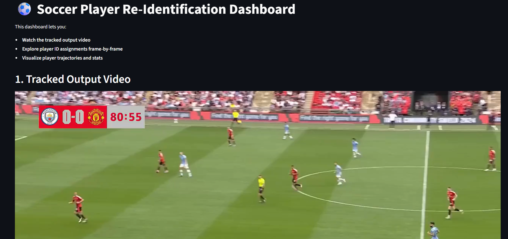

# Soccer Player Re-Identification – Task 2: Single-Camera Re-ID

[](https://soccer-task-2.onrender.com/)

**Live Demo:** [https://soccer-task-2.onrender.com/](https://soccer-task-2.onrender.com/)

---
Player Re-Identification

**Developed by Vivek V Nair**

All instructions, evaluation criteria, and detailed documentation are provided in the main `README.md` and `report.md` at the project root.

This folder contains only the code, requirements, and dashboard for Task 2.

- To run the pipeline, see the root README for setup and usage.
- For methodology and results, see the root report.
- Simplicity, modularity, and clarity of code
- Documentation quality
- Runtime efficiency (bonus)
- Creativity and thoughtfulness
- **Efficiency:** Reasonable runtime and resource usage.
- **Modularity:** Clean, organized, and extensible code structure.

## Folder Structure
```
task2/
├── src/                # Source code for detection, tracking, re-ID, and visualization
├── data/               # Input video and outputs (symlink or copy from main data/)
├── models/             # Model weights (symlink or copy from main models/)
├── requirements.txt    # Dependencies (symlink or copy from main)
├── README.md           # This file
├── report.md           # Project report for Task 2
```

## How to Run
1. Place your input video (`15sec_input_720p.mp4`) in `task2/data/` and model weights (`best.pt`) in `task2/models/`.
2. Install dependencies:
   ```bash
   pip install -r requirements.txt
   ```
3. Run the main pipeline:
   ```bash
   python src/main.py
   ```
4. Outputs (tracked video: `output_broadcast_tracked.mp4`, tracking JSON: `tracking_broadcast.json`) will appear in `task2/data/`.

---
For more details, see the full report in `report.md` and code comments in `src/`.
